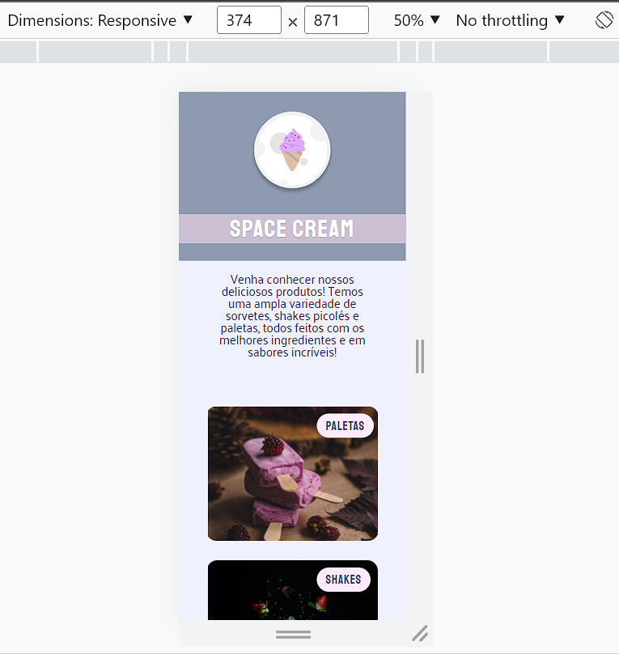
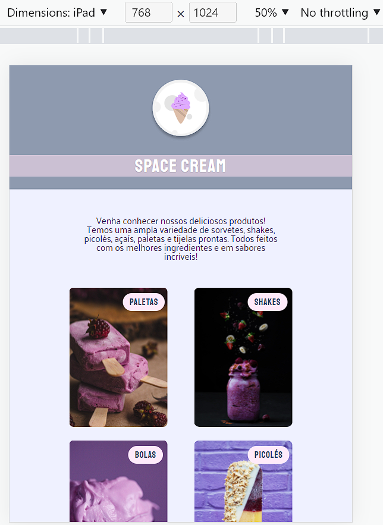
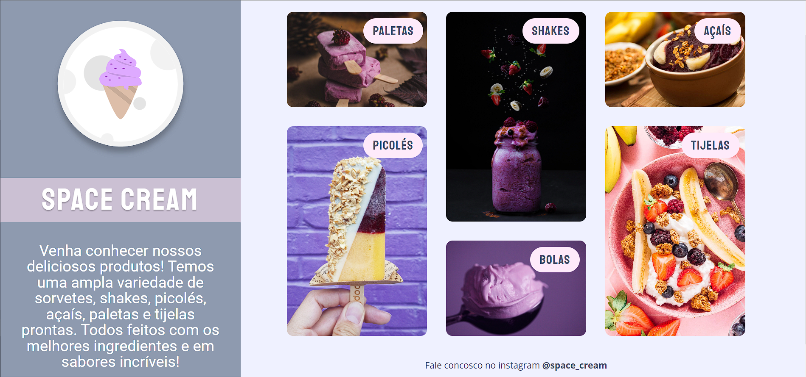

# Responsiveness - A responsive page from an ice cream shop website. 💻📱

 

>Explorer Trail - Rocketseat 🪐
## This project was made with the mobile first concept, grids and animations on CSS. I tried to make the page very dynamic with the animations. The layout was based on a figma project provided by Rocketseat course.

[🔗 Click here to access](https://tkoch97.github.io/icecream.store)

## 🔧 Tecnologies

HTML CSS  Git

## 📪 Contact

>Email: tkoch.gim@gmail.com
>Linkedin: https://www.linkedin.com/in/tkoch97/
>Instagram: https://www.instagram.com/tkoch_97/